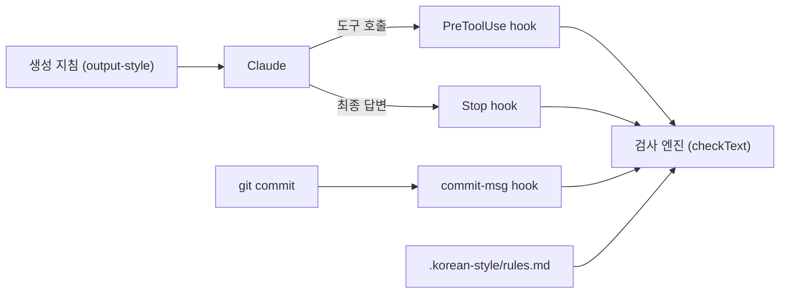

# im-a-korean-ai-in-seoul

이 도구는 Claude Code가 자연스러운 한국어를 쓰도록 생성 지침과 문체 검사 hook을 프로젝트에 설치합니다.

- **생성 지침(output-style):** 모델이 답할 때 지킬 어투, 의미 보존, 요청한 문장 수 같은 원칙을 담습니다.
- **문체 검사 hook:** Claude Code가 도구를 실행하기 직전에 파일에 쓸 내용, 사용자에게 묻는 질문, subagent 프롬프트, 커밋 메시지를 검사합니다. 최종 답변도 검사해 오류가 있으면 한 번만 다시 쓰게 합니다.
- **skill:** 문체를 진단하는 `korean-style`과 문장을 다듬거나 번역하는 `korean-rewrite`를 함께 설치합니다.
- **커밋 메시지 검사:** Git의 `commit-msg` hook으로 커밋 메시지를 검사합니다.

기술 용어를 영어로 써도 검사기는 막지 않습니다. 막는 것은 어투와 표기처럼 프로젝트가 정한 규칙을 어긴 경우입니다.
산문에 쓴 middle dot, em-dash, en-dash, emoji, 한자, 일본어 가나, 전각 괄호도 기본값에서 막습니다. 번역투와 긴 문장은 막지 않고 CLI에서 경고로만 보여 줍니다.

## 요구 사항

- Node.js 20 이상(npm 포함)
- Git
- Claude Code
- shell 환경(macOS, Linux 또는 WSL)

npm 패키지 의존성은 없습니다.

## 설치

### Claude Code에서 한 줄로 설치

이 도구를 설치할 프로젝트에서 Claude Code를 열고 아래 문장을 그대로 입력합니다.

> `npx -y github:nerdkim/im-a-korean-ai-in-seoul --target . --activate`로 이 프로젝트에 설치하고 `node .korean-style/scripts/doctor.mjs` 결과를 보여 주십시오.

Claude Code가 명령 실행을 허용할지 물으면 허용합니다. 설치가 끝나면 Claude Code를 종료하고 다시 시작합니다.
output-style과 hook은 새 세션부터 적용됩니다.

### shell에서 설치

프로젝트 루트에서 실행합니다.

```sh
npx -y github:nerdkim/im-a-korean-ai-in-seoul --target . --activate
node .korean-style/scripts/doctor.mjs
```

npx를 쓸 수 없으면 저장소를 내려받아 설치 스크립트를 직접 실행합니다.

```sh
git clone --depth 1 https://github.com/nerdkim/im-a-korean-ai-in-seoul.git /tmp/im-a-korean-ai-in-seoul
node /tmp/im-a-korean-ai-in-seoul/scripts/install.mjs --target "$PWD" --activate
```

새 프로젝트라면 디렉터리를 만들고 그 안에서 실행합니다. Git을 쓴다면 설치하기 전에 `git init`을 실행합니다.

### 설치 옵션

| 옵션 | 설명 |
| --- | --- |
| `--target <경로>` | 이 도구를 설치할 프로젝트의 루트입니다. 반드시 지정합니다. |
| `--activate` | 프로젝트의 output-style을 `korean-style`로 지정합니다. 생략하면 다른 output-style이 선택되어 있을 때는 그 설정을 유지하고, 선택된 것이 없을 때만 `korean-style`로 지정합니다. |
| `--register <어투>` | 생성 지침과 어투 검사에 쓸 어투입니다. `다나까체`(합니다체, 기본값), `해요체`, `혼용` 가운데 하나를 고릅니다. `혼용`은 두 어투를 모두 허용하되 한 답변 안에서는 하나로 맞추게 합니다. |
| `--dry-run` | 파일을 쓰지 않고 규칙 갱신 여부, 어투, 커밋 hook 경로 같은 설치 결과만 미리 보여 줍니다. |
| `--force` | 직접 수정한 규칙을 새 기본값으로 교체합니다. 교체하기 전에 백업합니다. |

답변과 문서, 주석, 커밋 메시지의 어투를 해요체로 맞추려면 설치 명령에 `--register 해요체`를 붙여 실행합니다.

설치 스크립트는 기존 `CLAUDE.md`, 다른 hook, 권한, MCP 설정, 다른 output-style 파일을 그대로 둡니다.
`.claude/settings.json`에는 hook 두 개를 더하고 필요할 때만 `outputStyle`을 바꿉니다. 사용자 전역 설정과 `.claude/settings.local.json`은 바꾸지 않습니다.
설정 파일이 손상되었거나 설치 경로에 같은 이름의 파일이나 symlink가 있으면 덮어쓰지 않고 멈춥니다.

## 설치되는 파일

| 경로 | 내용 | Git |
| --- | --- | --- |
| `.korean-style/rules.md` | 이 프로젝트의 검사 규칙 | 커밋 |
| `.korean-style/defaults.sha256` | 기본 규칙을 수정했는지 판별하는 값 | 커밋 |
| `.korean-style/scripts/` | 검사기, hook, doctor | 제외 |
| `.korean-style/docs/` | 기본 규칙 사본과 제약 문서 | 제외 |
| `.claude/output-styles/korean-style.md` | 생성 지침 | 제외 |
| `.claude/skills/korean-style/SKILL.md` | 문체 진단 skill | 제외 |
| `.claude/skills/korean-rewrite/SKILL.md` | 교정과 번역 skill | 제외 |
| `.claude/settings.json` | hook 두 개와 `outputStyle` 설정 | 커밋 |
| `.gitignore` | 위에서 제외로 표시한 항목 | 커밋 |
| `.git/hooks/commit-msg` | 커밋 메시지 검사 | 해당 없음 |

제외로 표시한 파일은 Git에 올리지 않고 설치할 때마다 새로 만듭니다. 그래서 저장소를 clone한 팀원도 설치 명령을 한 번 실행해야 합니다.

## 사용법

### 생성 지침

`outputStyle`이 `korean-style`이면 설치 후 새 세션부터 자동으로 적용됩니다. `.claude/settings.local.json`에 `outputStyle`이 있으면 그 값이 우선합니다.
다른 스타일을 쓰려면 `.claude/settings.json`의 `outputStyle`을 바꿉니다.
지침은 모델이 읽는 지시문이라 영어로 짧게 썼고, 예문과 어미만 한국어로 두었습니다.

### 문체 검사 hook

| 시점 | 검사 대상 | 오류가 있을 때 |
| --- | --- | --- |
| Claude Code가 도구를 실행하기 직전 | 파일에 쓸 내용(Write, Edit 등), 사용자에게 묻는 질문, 승인받을 계획, subagent 프롬프트, Bash로 실행하는 `git commit`의 메시지 | 실행을 막고 고칠 부분을 알려 줍니다 |
| Claude Code가 답변을 마칠 때 | 이번 turn의 최종 답변 | 재작성을 한 번만 요청합니다 |
| Git이 커밋할 때(`commit-msg` hook) | 커밋 메시지 | 커밋을 멈춥니다 |

Claude가 shell 명령으로 검사 대상 파일에 직접 쓰면 검사를 건너뛰게 됩니다. 그래서 hook은 그 명령을 막고 Write나 Edit 도구로 다시 쓰라고 안내합니다.
Stop hook은 답변이 화면에 표시된 뒤에 검사하므로 이미 표시된 답변은 되돌리지 못합니다. hook 실행 중에 예외가 발생하면 작업을 막지 않고 통과시킵니다.

### skill

Claude Code는 skill 설명을 보고 필요할 때 skill을 읽습니다. 직접 부르려면 메시지 맨 앞에 `/`와 skill 이름을 입력합니다.

| skill | 용도 | 예 |
| --- | --- | --- |
| `korean-style` | 문체 규칙을 확인하거나 어색한 표현을 진단합니다 | `/korean-style README.md에서 어색한 표현을 찾아 주십시오` |
| `korean-rewrite` | 한국어 문장을 다듬거나 영어 문서를 한국어로 옮깁니다 | `/korean-rewrite docs/guide.md를 자연스러운 한국어로 다듬어 주십시오` |

### 검사기 CLI

```sh
node .korean-style/scripts/check-korean.mjs --text '확인했습니다.'
node .korean-style/scripts/check-korean.mjs --file docs/guide.md
node .korean-style/scripts/check-korean.mjs --all
node .korean-style/scripts/check-korean.mjs --explain translationese
```

`--stdin`으로 표준 입력을 검사할 수 있고, `--target chat|doc|comment|commit`으로 글의 종류를 지정할 수 있습니다. 설치 스크립트의 `--target <경로>`와는 다른 옵션입니다.
오류가 있으면 종료 코드 1, 사용법이 틀리면 2입니다. 경고만 있으면 0이며 `--strict`를 주면 1입니다.
검사기는 파일을 자동으로 고치지 않습니다. 기존 문서에 오류가 있어도 설치가 실패한 것은 아닙니다.

## 동작 원리

이 도구는 모델이 글을 쓰기 전과 쓴 뒤에 각각 개입합니다. 생성 지침은 따를 원칙을 미리 알려 주고, 검사기는 쓴 결과를 프로젝트 규칙과 대조합니다.
검사기는 규칙 문서에 적힌 목록과 한도로 판정하는 Node.js 프로그램입니다. 모델을 호출하거나 네트워크에 접속하지 않으므로 같은 글과 같은 규칙에는 항상 같은 결과를 냅니다.



### 생성 지침이 적용되는 방식

Claude Code는 `outputStyle`로 고른 파일을 세션을 시작할 때 system prompt에 넣습니다. 그래서 모델은 답변할 때마다 파일을 다시 읽지 않고도 지침을 따릅니다.
지침의 frontmatter에 있는 `keep-coding-instructions: true`는 Claude Code의 기본 코딩 지침을 함께 유지합니다.
설치 스크립트는 지침의 `register:begin` 표시와 `register:end` 표시 사이를 설치할 어투의 조각으로 바꿉니다. 조각은 `skill/korean-style/register/`에 있습니다.
어투는 `--register`로 고르고, 생략하면 기존 규칙의 어투를 씁니다. 처음 설치할 때 생략하면 다나까체입니다. `korean-style` skill에도 같은 조각을 넣습니다.

### 검사 순서

모든 검사는 `scripts/lib/check.mjs`의 `checkText`를 거칩니다. hook 세 개와 CLI는 글마다 `chat`, `doc`, `comment`, `commit` 가운데 한 종류를 정해 이 함수에 넘깁니다.
종류에 따라 적용하는 규칙이 다릅니다. `checkText`는 받은 글을 다음 순서로 판정합니다.

1. **정규화:** 조합형으로 들어온 한글 자모를 완성형 음절로 합칩니다(NFC).
2. **주석 추출:** 종류가 `comment`이면 확장자별 주석 문법(`//`, `/* */`, `#`, `--`, Python docstring)으로 주석만 남기고 문자열 리터럴은 지웁니다. 한글이 든 줄만 남긴 뒤 `doc`으로 검사합니다.
3. **코드 제외:** fenced code block과 inline code를 같은 길이의 공백으로 바꿉니다. 줄 수가 그대로여서 보고하는 줄 번호가 원문과 일치합니다.
4. **규칙 실행:** `scripts/lib/rules/`의 규칙 모듈 일곱 개를 차례로 실행해 위반을 모읍니다.
5. **code block 재검사:** code block 안쪽은 일부 규칙으로만 한 번 더 검사합니다. 금지 글자(emoji 제외)와 어투, 호칭, 표기(외래어, 음차, 팀 용어), 오타 규칙을 적용하고 차별 소지 용어와 수량 표현 뒤 복수 접미사도 봅니다. 규칙 설정 블록(`korean-style-rules`)은 제외합니다.
6. **등급 분류:** `advisory-rules`에 든 규칙의 위반은 경고로, 나머지는 오류로 분류합니다. hook은 오류만 막습니다.

| 종류 | 대상 | 적용하는 규칙 |
| --- | --- | --- |
| `chat` | 최종 답변, 사용자에게 묻는 질문, 승인받을 계획, 사용자에게 보내는 파일 설명 | 공통 규칙에 더해 명령, 호칭, 칭찬, 영어 답변, 팀 용어 표기 규칙 |
| `doc` | Markdown 문서, subagent 프롬프트 | 공통 규칙 |
| `comment` | 소스 파일의 주석 | 공통 규칙 |
| `commit` | 커밋 메시지 | 공통 규칙 |

파일의 종류는 경로로 정합니다. `skip-globs`에 맞는 경로는 검사하지 않고, `doc-globs`와 `source-globs`를 확장자보다 먼저 봅니다.
그다음 `.md`, `.mdx`, `.markdown`은 `doc`으로, 지원하는 소스 확장자는 `comment`로 정하고 나머지 파일은 검사하지 않습니다.

### 규칙 모듈

| 모듈 | 보는 것 | 기본 등급 |
| --- | --- | --- |
| `chars.mjs` | middle dot, em-dash, en-dash, emoji, 한자, 일본어 가나, 전각 괄호 | 오류 |
| `register.mjs` | 선택한 어투와 다른 종결어미, 사람에게 내리는 명령, 금지 호칭, 칭찬으로 여는 문장, 영어로만 쓴 답변 | 오류(영어 답변은 경고) |
| `punctuation.mjs` | 쉼표 수, 쉼표 구간 길이, 접속부사와 연결어미 뒤 쉼표 | 경고 |
| `structure.mjs` | 이중피동, 긴 문장, 수량 표현 뒤 복수 접미사, 명사형 종결과 지시 표현, `~적`, `~의`의 빈도 | 이중피동은 오류, 나머지는 경고 |
| `translationese.mjs` | 번역투 구절, 영어 동사를 직역한 동사 | 경고 |
| `vocabulary.mjs` | 외래어 표기, 오타, 한글 음차, 팀 용어 표기, 설명 없이 쓴 용어, 차별 소지가 있는 용어, 영어 낱말에 한글 부정 접두사를 붙인 표현 | 오류(차별 소지 용어와 부정 접두사 표현은 경고) |
| `density.mjs` | 조사가 붙은 영어 낱말, 같은 용어의 반복 설명, 굵은 글씨, 대조 구문의 빈도 | 경고 |

`banned-transliteration`, `banned-translation`, `required-spelling`, `needs-gloss`는 기본값이 비어 있고 `max-bound-english-per-sentence`는 0입니다. 팀이 값을 채우면 그때부터 검사합니다.
어투, 명령, 호칭, 칭찬, 오타 규칙은 따옴표 안을 보지 않으므로 인용한 문장은 이 규칙들에 걸리지 않습니다.
문장 단위 규칙은 문단, 목록 항목, 표 칸을 따로 나눈 뒤 마침표, 물음표, 느낌표 뒤에서 문장을 자릅니다. 제목 줄과 부호만 늘어놓은 장식 줄은 문장으로 세지 않습니다.
쉼표 수, 쉼표 구간 길이, 긴 문장 규칙은 한글 비율이 `sentence-min-hangul-ratio` 이상이고 종결어미나 물음표, 느낌표로 끝나는 조각만 한국어 문장으로 셉니다.
두 쉼표 규칙은 따옴표와 괄호 안, 숫자 사이의 쉼표를 세지 않습니다. 짧은 항목을 쉼표로 늘어놓은 나열은 판정에서 뺍니다.
빈도 규칙은 한글 1000자당 횟수로 판정하고, 대조 구문만 공백을 뺀 전체 글자 수를 기준으로 삼습니다. 횟수가 `density-rule-floor`보다 적으면 판정하지 않고, 밀도가 `한도 × (1 + density-margin ÷ √횟수)`를 넘을 때만 보고합니다.
횟수가 적을수록 여유가 커지므로 적게 나온 표현은 밀도가 한도를 크게 넘어야 걸립니다.
오류와 경고를 나눈 근거는 [검사 규칙](docs/rules.md)에 있습니다.

### hook이 개입하는 지점

Claude Code는 도구를 실행하기 직전에 도구 이름과 입력을 JSON으로 `pretooluse.mjs`에 넘깁니다. hook은 도구에 따라 다음 부분을 검사합니다.

| 도구 | 검사하는 부분 | 종류 |
| --- | --- | --- |
| `Write`, `Edit`, `MultiEdit` | 편집을 적용한 뒤의 파일 전체 | 경로로 정합니다 |
| `NotebookEdit` | 새로 쓰는 셀 내용(`new_source`) | 경로로 정합니다 |
| `AskUserQuestion`, `ExitPlanMode`, `SendUserFile` | `chat-tool-fields`에 적은 필드 | `chat` |
| `Task`, `Agent` | `agent-tool-fields`에 적은 필드 | `doc` |
| `Bash` | `git commit` 명령의 `-m`과 `--message=` 값 | `commit` |

`Edit`와 `MultiEdit`이면 hook은 현재 파일에 바꿀 내용을 적용한 결과를 만들어 파일 전체를 검사합니다. 그래서 이번에 고치지 않은 부분의 오류도 함께 보고합니다.
파일을 읽지 못하거나 바꿀 문자열을 찾지 못하면 새 문자열만 검사합니다. `.ipynb`는 기본값에서 검사 대상이 아니므로 `doc-globs`에 넣어야 검사합니다.
`Bash` 명령이 `>`, `>>`, `tee`, `sed -i`, `perl -i`로 검사 대상 파일에 쓰려 하면 hook은 쓸 내용을 미리 알 수 없으므로 명령을 막고 Write나 Edit 도구로 다시 쓰라고 안내합니다.
오류가 있으면 hook은 `permissionDecision: deny`와 위반 목록을 돌려줍니다. Claude는 이 목록을 도구 실행 결과로 받아 문장을 고친 뒤 다시 시도합니다.

Claude Code가 답변을 마치면 `stop.mjs`가 마지막 답변(`last_assistant_message`)을 `chat`으로 검사합니다. 이 값을 주지 않는 구버전에서는 transcript에서 마지막 사용자 메시지 뒤의 답변을 모읍니다.
오류가 있으면 `decision: block`과 위반을 최대 세 건 돌려주고, Claude는 내용을 유지한 채 답변을 다시 씁니다.
다시 쓴 답변으로 hook이 실행되면 `stop_hook_active`가 켜져 있으므로 hook은 검사하지 않고 끝납니다. 재작성 요청이 한 번뿐인 이유입니다.

설치 스크립트는 `git rev-parse --git-path hooks/commit-msg`가 가리키는 경로에 작은 Node.js 실행기를 씁니다.
실행기는 커밋하는 checkout의 루트를 찾아 그 안의 `.korean-style/scripts/hooks/commit-msg.mjs`를 실행합니다. 이 스크립트는 `#`으로 시작하는 줄을 뺀 메시지를 `commit`으로 검사하고, 오류가 있으면 종료 코드 1로 커밋을 멈춥니다.

세 hook은 실행될 때마다 규칙 문서를 새로 읽습니다. 규칙을 고치면 Claude Code를 다시 시작하지 않아도 다음 검사부터 반영됩니다.

### 규칙 문서를 읽는 방식

검사기는 `.korean-style/rules.md`에서 `korean-style-rules` code block만 설정으로 읽고, 블록 밖의 설명은 읽지 않습니다.
블록의 각 줄은 `키: 값` 형식이고 `#`으로 시작하는 줄은 주석입니다. 목록은 쉼표로 나누고, 치환 후보는 `원문=후보`로, 도구 필드는 `도구.필드`로 적습니다.
규칙 문서를 열지 못하거나 블록이 없으면 CLI는 실패합니다. hook은 금지 글자와 호칭, 영어 답변만 보는 기본 최소 규칙으로 검사를 이어 갑니다.

### 재설치할 때 직접 고친 규칙을 보존하는 방식

설치 스크립트는 기본 규칙 문서에서 `register:` 줄의 값만 비우고 SHA-256 값을 구해 `.korean-style/defaults.sha256`에 적습니다.
다시 설치할 때 현재 `rules.md`에서 같은 방식으로 구한 값이 저장된 값이나 새 기본 규칙에서 구한 값과 같으면 규칙을 고치지 않은 것으로 보고 새 기본값으로 바꿉니다.
값이 다르면 직접 고친 규칙으로 보고 그대로 둡니다. 어투 줄은 비교에서 빼므로 `--register`로 어투만 바꾼 규칙은 고치지 않은 규칙으로 봅니다.
`.claude/settings.json`에서는 명령에 `.korean-style/scripts/hooks/pretooluse.mjs`나 `.korean-style/scripts/hooks/stop.mjs`가 든 hook만 이 도구의 것으로 보고 교체합니다. 다른 hook 항목은 그대로 둡니다.

## 규칙 바꾸기

`.korean-style/rules.md`의 `korean-style-rules` 블록을 고칩니다. 차단하지 않고 경고만 할 규칙은 `advisory-rules`에 넣습니다.
각 키의 뜻은 [검사 규칙](docs/rules.md)에 있습니다.
규칙을 고친 뒤에는 잡아야 할 문장과 통과해야 할 문장을 `--text`로 함께 확인합니다.

## 갱신과 팀 공유

같은 설치 명령을 다시 실행하면 검사기와 생성 지침을 최신으로 바꿉니다. hook을 중복으로 추가하지 않으며, `--register`를 주지 않으면 기존 어투를 유지합니다.
규칙을 수정하지 않았다면 새 기본값을 적용합니다. 직접 수정한 규칙과 수정 여부를 판별할 수 없는 구버전 규칙은 그대로 둡니다.
새 기본값으로 바꾸려면 `--force`를 추가합니다. 기존 규칙은 `.korean-style/rules.backup-*.md`에 백업하므로 필요한 내용을 옮겨 올 수 있습니다.

Git worktree와 `core.hooksPath`를 지원합니다. 여러 checkout이 함께 쓰는 커밋 hook도 커밋하는 checkout의 규칙을 따릅니다.
이미 다른 `commit-msg` hook이 있으면 덮어쓰지 않습니다. 함께 쓰려면 기존 hook에서 다음 명령을 호출합니다.

```sh
node .korean-style/scripts/hooks/commit-msg.mjs "$1" || exit $?
```

Git 없이 설치해도 Claude Code hook은 동작합니다. 나중에 `git init`을 실행하고 다시 설치하면 `.gitignore` 항목과 커밋 hook을 추가합니다.

## 제거

1. `.korean-style/`, `.claude/skills/korean-style/`, `.claude/skills/korean-rewrite/`, `.claude/output-styles/korean-style.md`를 지웁니다.
2. `.claude/settings.json`에서 명령에 `.korean-style/scripts/hooks/`가 들어간 hook 항목과 `"outputStyle": "korean-style"`을 지웁니다.
3. `.gitignore`에서 `# korean-style 설치 산출물입니다`로 시작하는 줄과 이 도구가 추가한 다음 여섯 줄을 지웁니다: `.korean-style/*`, `!.korean-style/rules.md`, `!.korean-style/defaults.sha256`, `.claude/skills/korean-style/`, `.claude/skills/korean-rewrite/`, `.claude/output-styles/korean-style.md`.
4. `git rev-parse --git-path hooks/commit-msg`가 가리키는 파일에 `korean-style commit hook`이 들어 있는 줄이 있으면 그 파일을 지웁니다. 기존 hook에 검사기 호출을 직접 추가했다면 그 줄도 지웁니다.

## 문제 해결

먼저 `node .korean-style/scripts/doctor.mjs`로 설치 상태를 확인합니다. 실패 항목이 있으면 종료 코드 1로 끝납니다.

- **스타일이나 hook이 적용되지 않을 때:** `.claude/settings.local.json`의 `outputStyle`과 `disableAllHooks`를 확인합니다. worktree에서는 주 checkout의 로컬 설정도 확인합니다. 적용 순서는 Claude Code의 [설정 우선순위](https://code.claude.com/docs/en/settings#settings-precedence)를 따릅니다.
- **조직 정책, 세션 옵션, 사용자 전역 설정을 확인할 때:** `doctor`는 프로젝트와 로컬 설정 파일만 읽습니다. Claude Code의 `/status`에서 실제 설정 출처를 확인합니다.
- **주의 항목:** 다른 커밋 hook을 쓰거나 커밋해야 할 파일이 Git에서 제외되어 있으면 `doctor`가 주의로 보고합니다.
- **설치가 멈출 때:** 손상된 설정 파일을 고치고, 같은 이름의 기존 파일이나 설치 경로의 symlink를 옮기거나 지운 뒤 다시 설치합니다.

## 다른 코딩 agent

output-style과 문체 검사 hook은 Claude Code에서만 동작합니다. Codex나 Gemini CLI에서는 적용되지 않습니다.
커밋 메시지 검사는 Git hook으로 동작하므로 어떤 프로그램으로 커밋해도 적용됩니다.
같은 생성 지침을 따르게 하려면 한국어를 쓰기 전에 `.claude/output-styles/korean-style.md`를 읽으라는 지시를 `AGENTS.md`나 `GEMINI.md`에 적습니다.

## 개발

이 저장소를 고칠 때는 `CLAUDE.md`를 따릅니다. `AGENTS.md`와 `GEMINI.md`는 `CLAUDE.md`를 가리키는 symlink입니다.
한국어 산문을 바꾸면 커밋하기 전에 `korean-reviewer` agent(`.claude/agents/korean-reviewer.md`)로 diff를 검토합니다.

```sh
npm run gate                    # 자체 검사, 회귀 테스트, 문체 검사
npm run doctor                  # 이 저장소의 설정 확인
npm run eval -- --run           # 실모델 비교, API 사용량 발생
```

일반 테스트는 API를 호출하지 않습니다. 실모델 비교는 기본적으로 임시 프로젝트에서 `low` effort로 요청을 묶어 실행합니다.
`--individual`은 요청마다 새 세션을 쓰고 `--with-hooks`는 임시 프로젝트에 이 도구를 설치해 hook까지 검증합니다.
`--cases test/fixtures/eval/regression.json`처럼 입력을 고를 수 있습니다.
응답 원본은 `.eval/latest/`에 저장하며 다시 실행할 때는 `--out .eval/run2`처럼 새 경로를 지정합니다.
[평가 입력](test/fixtures/eval/)만 Git에 두고 실행 결과는 커밋하지 않습니다.
원문과 응답은 함께 놓고 검토합니다.

[생성 지침](output-styles/korean-style.md), [검사 규칙](docs/rules.md), [제약](docs/limits.md)에 세부 내용이 있습니다.

## 라이선스

[MIT](LICENSE)
